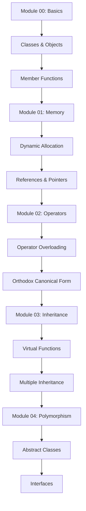

# 🔥 C++ Modules

[](https://42.fr)
[](https://en.wikipedia.org/wiki/C%2B%2B)
[](https://en.cppreference.com/w/cpp/98)
[](https://github.com/th3f/42-Cursus)

> *"C++ is a horrible language. It's made more horrible by the fact that a lot of substandard programmers use it."* - Linus Torvalds
> 
> *"But when used correctly, it's incredibly powerful."* - Every C++ Developer

A comprehensive journey through C++ programming concepts, from basic syntax to advanced object-oriented programming techniques following the C++98 standard.

## 📋 Table of Contents

- [🎯 About](#-about)
- [📚 Modules Overview](#-modules-overview)
- [✨ Key Concepts](#-key-concepts)
- [🚀 Installation](#-installation)
- [💻 Usage](#-usage)
- [📁 Project Structure](#-project-structure)
- [🎯 Learning Path](#-learning-path)
- [🔧 Compilation](#-compilation)
- [🧪 Testing](#-testing)
- [📚 Learning Objectives](#-learning-objectives)
- [📖 Resources](#-resources)

## 🎯 About

The **C++ Modules** are a series of 42 School projects designed to introduce students to C++ programming concepts progressively. Each module builds upon the previous one, covering fundamental to advanced topics in object-oriented programming, memory management, and C++ best practices.

**Key Features:**
- **Progressive Learning**: Step-by-step introduction to C++ concepts
- **C++98 Standard**: Focus on fundamental C++ features
- **Practical Exercises**: Real-world programming scenarios
- **Best Practices**: Emphasis on clean, maintainable code
- **Memory Management**: Deep understanding of resource handling

## 📚 Modules Overview

### 🌟 Module 00: Basics and Classes
**Topics Covered:**
- Namespaces and scope resolution
- Classes and objects fundamentals
- Member functions and data
- Input/output streams
- Basic memory management

**Key Exercises:**
- `ex00`: Megaphone - String manipulation and streams
- `ex01`: My Awesome PhoneBook - Basic class design
- `ex02`: Account class - Static members and methods

### 🔧 Module 01: Memory and Pointers
**Topics Covered:**
- Dynamic memory allocation
- References vs pointers
- Memory leaks prevention
- File stream handling
- Switch statements and alternatives

**Key Exercises:**
- `ex00`: BraiiiiiiinnnzzzZ - Zombie class basics
- `ex01`: Moar brainz! - Dynamic allocation
- `ex02`: HI THIS IS BRAIN - References and pointers
- `ex03`: Unnecessary violence - Weapon class design
- `ex04`: Sed is for losers - File manipulation
- `ex05`: Harl 2.0 - Function pointers
- `ex06`: Harl filter - Advanced filtering

### 🏗️ Module 02: Ad-hoc Polymorphism
**Topics Covered:**
- Operator overloading
- Orthodox Canonical Form
- Fixed-point arithmetic
- Copy constructors and assignment operators
- Ad-hoc polymorphism concepts

**Key Exercises:**
- `ex00`: My First Class in Orthodox Canonical Form
- `ex01`: Towards a more useful fixed-point number class
- `ex02`: Now we're talking - Full operator support
- `ex03`: BSP (Binary Space Partitioning) - Geometric algorithms

### 🎭 Module 03: Inheritance
**Topics Covered:**
- Class inheritance hierarchy
- Virtual functions introduction
- Protected members
- Multiple inheritance basics
- Diamond problem awareness

**Key Exercises:**
- `ex00`: Aaaaand... OPEN! - Basic inheritance
- `ex01`: Serena, my love! - ScavTrap inheritance
- `ex02`: Repetitive work - FragTrap and virtual inheritance
- `ex03`: Now it's weird! - DiamondTrap multiple inheritance

### 🎨 Module 04: Subtype Polymorphism
**Topics Covered:**
- Abstract classes and interfaces
- Pure virtual functions
- Virtual destructors
- Polymorphism in practice
- Deep vs shallow copy issues

**Key Exercises:**
- `ex00`: Wake up sheeple! - Abstract Animal class
- `ex01`: I don't want to set the world on fire - Brain class
- `ex02`: Abstract class - Pure virtual functions
- `ex03`: Interface & recap - Materia system

## ✨ Key Concepts

### 🏗️ Object-Oriented Programming Pillars

#### 1. **Encapsulation**
```cpp
class BankAccount {
private:
    double balance;
    std::string account_number;

public:
    BankAccount(std::string number) : account_number(number), balance(0.0) {}
    void deposit(double amount);
    bool withdraw(double amount);
    double getBalance() const { return balance; }
};
```

#### 2. **Inheritance**
```cpp
class Animal {
protected:
    std::string name;
public:
    Animal(std::string n) : name(n) {}
    virtual void makeSound() = 0;  // Pure virtual
    virtual ~Animal() {}           // Virtual destructor
};

class Dog : public Animal {
public:
    Dog(std::string n) : Animal(n) {}
    void makeSound() override { std::cout << "Woof!" << std::endl; }
};
```

#### 3. **Polymorphism**
```cpp
void playWithAnimal(Animal* animal) {
    animal->makeSound();  // Calls appropriate implementation
}

int main() {
    Dog* dog = new Dog("Buddy");
    Cat* cat = new Cat("Whiskers");
    
    playWithAnimal(dog);  // Output: "Woof!"
    playWithAnimal(cat);  // Output: "Meow!"
    
    delete dog;
    delete cat;
    return 0;
}
```

### 🔧 Orthodox Canonical Form

Every class should implement the "Big Four":

```cpp
class MyClass {
private:
    int* data;
    size_t size;

public:
    // 1. Default Constructor
    MyClass() : data(nullptr), size(0) {}
    
    // 2. Copy Constructor
    MyClass(const MyClass& other) : size(other.size) {
        if (size > 0) {
            data = new int[size];
            for (size_t i = 0; i < size; ++i)
                data[i] = other.data[i];
        } else {
            data = nullptr;
        }
    }
    
    // 3. Assignment Operator
    MyClass& operator=(const MyClass& other) {
        if (this != &other) {  // Self-assignment check
            delete[] data;     // Clean up existing resources
            
            size = other.size;
            if (size > 0) {
                data = new int[size];
                for (size_t i = 0; i < size; ++i)
                    data[i] = other.data[i];
            } else {
                data = nullptr;
            }
        }
        return *this;
    }
    
    // 4. Destructor
    ~MyClass() {
        delete[] data;
    }
};
```

### 💾 Memory Management Best Practices

```cpp
class SmartResource {
private:
    int* resource;

public:
    SmartResource(int value) : resource(new int(value)) {}
    
    ~SmartResource() {
        delete resource;  // Always clean up
        resource = nullptr;
    }
    
    // RAII (Resource Acquisition Is Initialization)
    int getValue() const { 
        return resource ? *resource : 0; 
    }
};
```

## 🚀 Installation

### Prerequisites
- **C++ Compiler**: g++ or clang++ with C++98 support
- **Make**: Build automation tool
- **Git**: Version control system

### Build Instructions
```bash
# Clone the repository
git clone https://github.com/yourusername/42-Cursus.git
cd 42-Cursus/Cpp-Modules

# Navigate to specific module
cd Cpp-Module-00/ex00

# Build the exercise
make

# Clean build files
make clean

# Remove all generated files
make fclean

# Rebuild everything
make re
```

### Compilation Standards
```makefile
CXX = c++
CXXFLAGS = -Wall -Wextra -Werror -std=c++98
```

## 💻 Usage

### Module 00 Examples
```bash
# Megaphone exercise
./megaphone "shhhhh... I think the students are asleep..."
# Output: SHHHHH... I THINK THE STUDENTS ARE ASLEEP...

# PhoneBook exercise
./phonebook
> ADD
> First Name: John
> Last Name: Doe
> Nickname: JD
> Phone Number: 555-1234
> Darkest Secret: Loves pineapple pizza
```

### Module 01 Examples
```bash
# Zombie exercise
./zombie
# Creates zombies on stack and heap

# Brain exercise
./brain
# Demonstrates references vs pointers

# Harl exercise
./harl DEBUG
# Shows different complaint levels
```

### Module 02 Examples
```bash
# Fixed point arithmetic
./fixed
# Demonstrates operator overloading

# BSP (Binary Space Partitioning)
./bsp
# Tests point-in-triangle algorithms
```

## 📁 Project Structure

```
Cpp-Modules/
├── Cpp-Module-00/
│   ├── ex00/                 # Megaphone
│   │   ├── Makefile
│   │   └── megaphone.cpp
│   ├── ex01/                 # PhoneBook
│   │   ├── Makefile
│   │   ├── main.cpp
│   │   ├── PhoneBook.cpp
│   │   ├── PhoneBook.hpp
│   │   ├── Contact.cpp
│   │   └── Contact.hpp
│   └── ex02/                 # Account
│       ├── Makefile
│       ├── Account.cpp
│       ├── Account.hpp
│       └── tests.cpp
├── Cpp-Module-01/
│   ├── ex00/                 # BraiiiiiiinnnzzzZ
│   ├── ex01/                 # Moar brainz!
│   ├── ex02/                 # HI THIS IS BRAIN
│   ├── ex03/                 # Unnecessary violence
│   ├── ex04/                 # Sed is for losers
│   ├── ex05/                 # Harl 2.0
│   └── ex06/                 # Harl filter
├── Cpp-Module-02/
│   ├── ex00/                 # Orthodox Canonical Form
│   ├── ex01/                 # Fixed-point number class
│   ├── ex02/                 # Operator overloading
│   └── ex03/                 # BSP
├── Cpp-Module-03/
│   ├── ex00/                 # Basic inheritance
│   ├── ex01/                 # ScavTrap
│   ├── ex02/                 # FragTrap
│   └── ex03/                 # DiamondTrap
└── Cpp-Module-04/
    ├── ex00/                 # Abstract Animal
    ├── ex01/                 # Brain class
    ├── ex02/                 # Abstract class
    └── ex03/                 # Interface & recap
```

## 🎯 Learning Path

### 📈 Progression Roadmap



### 🎓 Skill Development

#### **Beginner Level** (Module 00)
- Basic C++ syntax and semantics
- Class definition and instantiation
- Member function implementation
- Input/output stream operations

#### **Intermediate Level** (Modules 01-02)
- Dynamic memory management
- Reference semantics
- Operator overloading techniques
- Copy semantics and resource management

#### **Advanced Level** (Modules 03-04)
- Inheritance hierarchies
- Virtual function tables
- Polymorphic behavior
- Abstract base classes and interfaces

## 🔧 Compilation

### Standard Makefile Template
```makefile
NAME = program_name

CXX = c++
CXXFLAGS = -Wall -Wextra -Werror -std=c++98

SRCDIR = .
OBJDIR = obj
SOURCES = $(wildcard $(SRCDIR)/*.cpp)
OBJECTS = $(SOURCES:$(SRCDIR)/%.cpp=$(OBJDIR)/%.o)

all: $(NAME)

$(NAME): $(OBJECTS)
	$(CXX) $(CXXFLAGS) -o $@ $^

$(OBJDIR)/%.o: $(SRCDIR)/%.cpp | $(OBJDIR)
	$(CXX) $(CXXFLAGS) -c $< -o $@

$(OBJDIR):
	mkdir -p $(OBJDIR)

clean:
	rm -rf $(OBJDIR)

fclean: clean
	rm -f $(NAME)

re: fclean all

.PHONY: all clean fclean re
```

### Compilation Best Practices
```bash
# Enable all warnings and treat them as errors
c++ -Wall -Wextra -Werror -std=c++98 *.cpp -o program

# Debug compilation
c++ -Wall -Wextra -Werror -std=c++98 -g3 *.cpp -o program

# Optimized compilation
c++ -Wall -Wextra -Werror -std=c++98 -O2 *.cpp -o program
```

## 🧪 Testing

### Unit Testing Strategy
```cpp
// Simple test framework
class TestRunner {
public:
    static void assert_equal(int expected, int actual, std::string test_name) {
        if (expected == actual) {
            std::cout << "✅ " << test_name << " PASSED" << std::endl;
        } else {
            std::cout << "❌ " << test_name << " FAILED" << std::endl;
            std::cout << "   Expected: " << expected << std::endl;
            std::cout << "   Actual: " << actual << std::endl;
        }
    }
};

// Usage example
void test_fixed_point_arithmetic() {
    Fixed a(5.25f);
    Fixed b(2.5f);
    Fixed result = a + b;
    
    TestRunner::assert_equal(7.75f, result.toFloat(), "Addition Test");
}
```

### Memory Testing
```bash
# Check for memory leaks
valgrind --leak-check=full ./program

# Check for undefined behavior
valgrind --tool=memcheck ./program

# Static analysis
cppcheck --enable=all *.cpp
```

### Automated Testing Script
```bash
#!/bin/bash

echo "Running C++ Modules Test Suite..."

modules=("Cpp-Module-00" "Cpp-Module-01" "Cpp-Module-02" "Cpp-Module-03" "Cpp-Module-04")

for module in "${modules[@]}"; do
    echo "Testing $module..."
    cd "$module"
    
    for exercise in ex*/; do
        if [ -d "$exercise" ]; then
            echo "  Testing $exercise"
            cd "$exercise"
            
            if make > /dev/null 2>&1; then
                echo "    ✅ Compilation successful"
                if [ -f test_input.txt ]; then
                    ./$(ls | grep -v '\.') < test_input.txt > output.txt 2>&1
                    echo "    ✅ Execution completed"
                fi
                make clean > /dev/null 2>&1
            else
                echo "    ❌ Compilation failed"
            fi
            
            cd ..
        fi
    done
    
    cd ..
    echo ""
done
```

## 📚 Learning Objectives

### 🎯 Module-Specific Goals

#### **Module 00: Foundation**
- Master basic C++ syntax and compilation
- Understand class-based programming
- Learn proper code organization
- Practice input/output operations

#### **Module 01: Memory Mastery**
- Understand stack vs heap allocation
- Master reference and pointer semantics
- Learn proper resource management
- Practice file I/O operations

#### **Module 02: Operator Excellence**
- Implement comprehensive operator overloading
- Master the Orthodox Canonical Form
- Understand copy semantics deeply
- Practice numerical programming

#### **Module 03: Inheritance Hierarchies**
- Design proper inheritance structures
- Understand virtual function mechanics
- Handle multiple inheritance complexities
- Solve the diamond problem

#### **Module 04: Polymorphic Mastery**
- Create abstract base classes
- Implement pure virtual interfaces
- Master runtime polymorphism
- Design flexible, extensible systems

### 🏆 Overall Programming Skills
- **Code Quality**: Write clean, maintainable C++ code
- **Memory Safety**: Prevent leaks and undefined behavior
- **Object-Oriented Design**: Apply OOP principles effectively
- **Performance Awareness**: Understand efficiency implications
- **Best Practices**: Follow industry-standard conventions

## 📖 Resources

### 📚 Essential C++ References
- [C++ Reference](https://en.cppreference.com/) - Comprehensive language reference
- [The C++ Programming Language](https://www.amazon.com/C-Programming-Language-4th/dp/0321563840) - Bjarne Stroustrup
- [Effective C++](https://www.amazon.com/Effective-Specific-Improve-Programs-Designs/dp/0321334876) - Scott Meyers
- [C++ Core Guidelines](https://isocpp.github.io/CppCoreGuidelines/) - Best practices

### 🔧 Development Tools
- [GDB Debugger](https://www.gnu.org/software/gdb/) - Debugging C++ programs
- [Valgrind](https://valgrind.org/) - Memory error detection
- [Clang-Tidy](https://clang.llvm.org/extra/clang-tidy/) - Static analysis
- [CppCheck](http://cppcheck.sourceforge.net/) - Static analysis tool

### 🎓 Learning Platforms
- [42 Cursus Documentation](https://42.fr) - Official 42 resources
- [Learn C++](https://www.learncpp.com/) - Comprehensive tutorials
- [C++ Primer](https://www.amazon.com/Primer-5th-Stanley-B-Lippman/dp/0321714113) - Stanley Lippman
- [cplusplus.com](https://www.cplusplus.com/) - Tutorials and reference

### 🧪 Practice Platforms
- [HackerRank C++](https://www.hackerrank.com/domains/cpp) - Programming challenges
- [LeetCode](https://leetcode.com/) - Algorithm practice
- [Codewars](https://www.codewars.com/) - Coding kata
- [AtCoder](https://atcoder.jp/) - Competitive programming

---

<div align="center">

**C++ Modules** - From basic syntax to advanced object-oriented mastery 🔥

*Made with ❤️ at 42 School*

</div>
