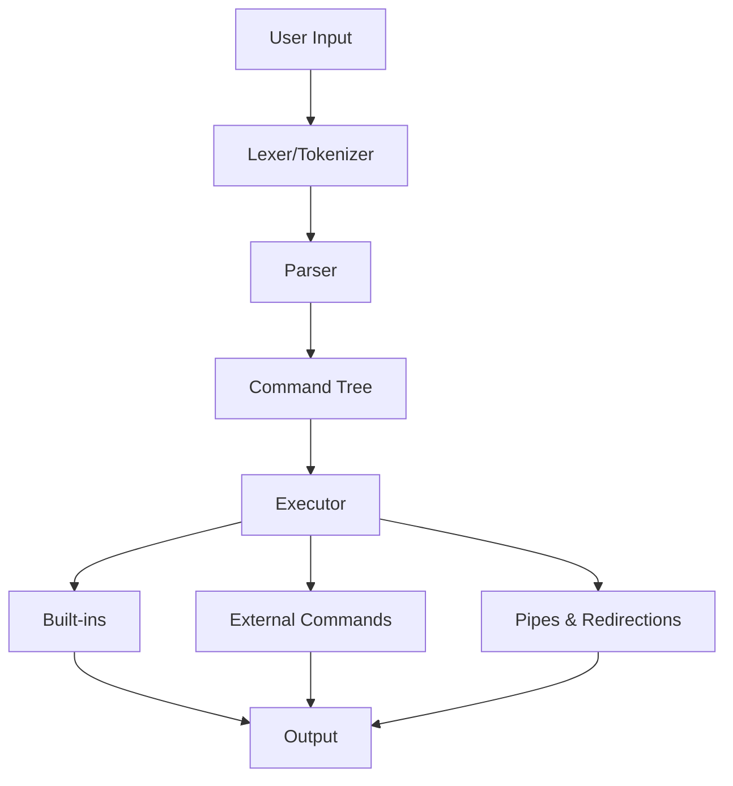

# 🐚 Minishell

[](https://42.fr)
[](https://en.wikipedia.org/wiki/C_(programming_language))
[](https://pubs.opengroup.org/onlinepubs/9699919799/utilities/sh.html)
[](https://github.com/th3f/42-Cursus)

> *"The shell is the command interpreter on Unix systems."* - Brian Kernighan

A custom implementation of a Unix shell with advanced features including pipes, redirections, environment variables, and signal handling.

## 📋 Table of Contents

- [🎯 About](#-about)
- [✨ Features](#-features)
- [🏗️ Architecture](#️-architecture)
- [🚀 Installation](#-installation)
- [💻 Usage](#-usage)
- [🔧 Built-in Commands](#-built-in-commands)
- [⚙️ Advanced Features](#️-advanced-features)
- [📁 Project Structure](#-project-structure)
- [🧪 Testing](#-testing)
- [📚 Learning Objectives](#-learning-objectives)
- [📖 Resources](#-resources)

## 🎯 About

**Minishell** is a 42 School project that challenges students to create their own Unix shell from scratch. This project provides deep insights into process management, system calls, and the inner workings of command-line interfaces.

**Key Concepts:**
- Process creation and management
- Inter-process communication (pipes)
- File descriptors and I/O redirection
- Signal handling and job control
- Environment variable management
- Command parsing and tokenization

## ✨ Features

### 🌟 Core Shell Features
- **Command Execution**: Execute any system command with proper PATH resolution
- **Built-in Commands**: Implementation of essential shell built-ins
- **Command History**: Navigate through previously executed commands
- **Prompt Display**: Customizable shell prompt with current directory
- **Error Handling**: Comprehensive error reporting and handling

### 🔄 Advanced I/O Features
- **Pipes**: Chain multiple commands together (`|`)
- **Input Redirection**: Read input from files (`<`)
- **Output Redirection**: Write output to files (`>`, `>>`)
- **Here Documents**: Multi-line input with delimiters (`<<`)
- **File Descriptor Management**: Proper handling of stdin, stdout, stderr

### 🌍 Environment Features
- **Environment Variables**: Access and modify system environment
- **Variable Expansion**: Support for `$VAR` and `${VAR}` syntax
- **Exit Status**: Track and access previous command exit codes (`$?`)
- **Local Variables**: Set and use shell-specific variables

### ⚡ Process Management
- **Signal Handling**: Proper response to SIGINT, SIGQUIT, SIGTERM
- **Background Jobs**: Basic job control mechanisms
- **Process Groups**: Correct process group management
- **Exit Codes**: Accurate exit status propagation

## 🏗️ Architecture

### Component Overview


### Core Components

#### 1. **Lexical Analysis** (`parsing/`)
- Tokenization of input strings
- Quote handling and escaping
- Variable expansion preprocessing
- Syntax validation

#### 2. **Parser** (`parsing/`)
- Command structure parsing
- Pipe and redirection analysis
- Abstract Syntax Tree (AST) generation
- Error detection and reporting

#### 3. **Executor** (`execution/`)
- Command execution coordination
- Process creation and management
- File descriptor manipulation
- Pipeline implementation

#### 4. **Built-ins** (`execution/`)
- Native command implementations
- Environment manipulation
- Directory navigation
- Process control

## 🚀 Installation

### Prerequisites
- **GCC** or **Clang** compiler
- **Make** build system
- **GNU Readline** library
- **POSIX-compliant** Unix system

### Installation Steps
```bash
# Clone the repository
git clone https://github.com/yourusername/42-Cursus.git
cd 42-Cursus/Minishell

# Install dependencies (Ubuntu/Debian)
sudo apt-get update
sudo apt-get install libreadline-dev

# Build the project
make

# Clean build files
make clean

# Remove all generated files
make fclean

# Rebuild everything
make re
```

### Compilation Flags
```makefile
CFLAGS = -Wall -Wextra -Werror -g3
LDFLAGS = -lreadline -lhistory
```

## 💻 Usage

### Basic Usage
```bash
# Start the shell
./minishell

# You'll see the custom prompt
minishell$ 
```

### Command Examples
```bash
# Basic commands
minishell$ ls -la
minishell$ pwd
minishell$ echo "Hello, World!"

# Pipes
minishell$ ls | grep .c | wc -l
minishell$ cat file.txt | sort | uniq

# Redirections
minishell$ echo "Hello" > output.txt
minishell$ cat < input.txt
minishell$ ls >> log.txt 2>&1

# Here documents
minishell$ cat << EOF
> This is a
> multi-line input
> EOF

# Environment variables
minishell$ echo $PATH
minishell$ export MY_VAR="Hello World"
minishell$ echo $MY_VAR

# Background processes
minishell$ sleep 10 &
minishell$ jobs
```

## 🔧 Built-in Commands

### Navigation Commands
| Command | Description | Example |
|---------|-------------|---------|
| `cd` | Change directory | `cd /home/user` |
| `pwd` | Print working directory | `pwd` |

### Environment Commands
| Command | Description | Example |
|---------|-------------|---------|
| `env` | Display environment variables | `env` |
| `export` | Set environment variable | `export VAR=value` |
| `unset` | Remove environment variable | `unset VAR` |

### Process Commands
| Command | Description | Example |
|---------|-------------|---------|
| `exit` | Exit the shell | `exit 0` |
| `jobs` | List active jobs | `jobs` |
| `kill` | Send signal to process | `kill -9 1234` |

### Utility Commands
| Command | Description | Example |
|---------|-------------|---------|
| `echo` | Print text | `echo "Hello World"` |
| `history` | Show command history | `history` |
| `help` | Display help information | `help` |

### Built-in Implementation Example
```c
int	builtin_cd(char **args)
{
	char	*path;
	char	*oldpwd;

	if (!args[1])
		path = getenv("HOME");
	else
		path = args[1];
	
	oldpwd = getcwd(NULL, 0);
	if (chdir(path) == -1)
	{
		perror("cd");
		free(oldpwd);
		return (1);
	}
	
	setenv("OLDPWD", oldpwd, 1);
	setenv("PWD", getcwd(NULL, 0), 1);
	free(oldpwd);
	return (0);
}
```

## ⚙️ Advanced Features

### 1. **Signal Handling**
```c
void	setup_signals(void)
{
	signal(SIGINT, handle_sigint);    // Ctrl+C
	signal(SIGQUIT, handle_sigquit);  // Ctrl+\
	signal(SIGTERM, handle_sigterm);  // Termination
}

void	handle_sigint(int sig)
{
	(void)sig;
	write(1, "\n", 1);
	rl_replace_line("", 0);
	rl_on_new_line();
	rl_redisplay();
}
```

### 2. **Pipeline Implementation**
```c
int	execute_pipeline(t_command *cmd)
{
	int		pipe_fd[2];
	pid_t	pid;

	if (pipe(pipe_fd) == -1)
		return (handle_error("pipe"));

	pid = fork();
	if (pid == 0)
	{
		// Child process
		dup2(pipe_fd[1], STDOUT_FILENO);
		close(pipe_fd[0]);
		close(pipe_fd[1]);
		execute_command(cmd);
	}
	else
	{
		// Parent process
		dup2(pipe_fd[0], STDIN_FILENO);
		close(pipe_fd[0]);
		close(pipe_fd[1]);
		waitpid(pid, NULL, 0);
	}
	return (0);
}
```

### 3. **Variable Expansion**
```c
char	*expand_variables(char *str)
{
	char	*result;
	char	*var_name;
	char	*var_value;
	int		i = 0;

	result = malloc(strlen(str) * 2);
	while (str[i])
	{
		if (str[i] == '$')
		{
			var_name = extract_var_name(str + i + 1);
			var_value = getenv(var_name);
			if (var_value)
				strcat(result, var_value);
			i += strlen(var_name) + 1;
		}
		else
			strncat(result, &str[i++], 1);
	}
	return (result);
}
```

### 4. **Memory Management**
```c
typedef struct s_gc
{
	void			*ptr;
	struct s_gc		*next;
}	t_gc;

void	*gc_malloc(size_t size)
{
	void	*ptr;
	t_gc	*node;

	ptr = malloc(size);
	if (!ptr)
		return (NULL);
	
	node = malloc(sizeof(t_gc));
	node->ptr = ptr;
	node->next = get_gc_list();
	set_gc_list(node);
	
	return (ptr);
}

void	gc_cleanup(void)
{
	t_gc	*current;
	t_gc	*next;

	current = get_gc_list();
	while (current)
	{
		next = current->next;
		free(current->ptr);
		free(current);
		current = next;
	}
	set_gc_list(NULL);
}
```

## 📁 Project Structure

```
Minishell/
├── Makefile              # Build configuration
├── main.c               # Program entry point
├── minishell.h          # Main header file
├── gc.h                 # Garbage collector header
├── signals.c            # Signal handling
├── parsing/
│   ├── lexer.c          # Token analysis
│   ├── parser.c         # Command parsing
│   ├── quotes.c         # Quote handling
│   └── expansion.c      # Variable expansion
├── execution/
│   ├── executor.c       # Command execution
│   ├── pipes.c          # Pipeline handling
│   ├── redirections.c   # I/O redirection
│   ├── builtins/
│   │   ├── cd.c         # Change directory
│   │   ├── echo.c       # Echo command
│   │   ├── env.c        # Environment display
│   │   ├── exit.c       # Exit command
│   │   ├── export.c     # Variable export
│   │   ├── pwd.c        # Print working directory
│   │   └── unset.c      # Variable removal
├── garbage_collector/
│   ├── gc.c             # Memory management
│   └── gc_utils.c       # GC utilities
└── libft/               # Custom C library
```

## 🧪 Testing

### Manual Testing
```bash
# Basic command testing
./minishell
echo "Hello World"
ls -la
pwd
cd /tmp
pwd

# Pipe testing
ls | grep .c
cat /etc/passwd | head -5 | tail -2

# Redirection testing
echo "test" > file.txt
cat < file.txt
ls >> output.log 2>&1

# Built-in testing
export TEST_VAR="42"
echo $TEST_VAR
unset TEST_VAR
exit
```

### Automated Testing
```bash
# Create test script
cat > test_minishell.sh << 'EOF'
#!/bin/bash

echo "Testing basic commands..."
echo "echo hello" | ./minishell
echo "pwd" | ./minishell
echo "env | grep PATH" | ./minishell

echo "Testing pipes..."
echo "ls | wc -l" | ./minishell

echo "Testing redirections..."
echo "echo test > /tmp/test.txt && cat /tmp/test.txt" | ./minishell

echo "All tests completed!"
EOF

chmod +x test_minishell.sh
./test_minishell.sh
```

### Memory Testing
```bash
# Check for memory leaks
valgrind --leak-check=full --track-origins=yes ./minishell

# Stress testing
for i in {1..100}; do
    echo "echo test $i" | ./minishell
done
```

### Comparison Testing
```bash
# Compare with bash behavior
echo "echo hello | cat" | bash
echo "echo hello | cat" | ./minishell

# Test edge cases
echo "" | ./minishell              # Empty input
echo "     " | ./minishell         # Whitespace only
echo "invalid_command" | ./minishell  # Non-existent command
```

## 📚 Learning Objectives

After completing this project, you will understand:

### 🔧 System Programming
- Unix process model and system calls
- File descriptor manipulation and I/O redirection
- Inter-process communication mechanisms
- Signal handling and process control

### 🏗️ Software Architecture
- Modular design principles
- Parser and lexer implementation
- Abstract Syntax Tree (AST) construction
- Component separation and interfaces

### 💾 Memory Management
- Dynamic memory allocation strategies
- Garbage collection implementation
- Resource lifecycle management
- Memory leak prevention

### 🔍 Problem Solving
- Complex parsing algorithms
- Error handling strategies
- Performance optimization techniques
- Testing and debugging methodologies

## 📖 Resources

### 📚 Shell Programming
- [Advanced Bash Scripting Guide](https://tldp.org/LDP/abs/html/)
- [POSIX Shell Command Language](https://pubs.opengroup.org/onlinepubs/9699919799/utilities/sh.html)
- [GNU Bash Manual](https://www.gnu.org/software/bash/manual/bash.html)

### 🔧 System Programming
- [Advanced Programming in the UNIX Environment](https://www.amazon.com/Advanced-Programming-UNIX-Environment-3rd/dp/0321637739)
- [The Linux Programming Interface](https://man7.org/tlpi/)
- [Process Management](https://www.tutorialspoint.com/unix/unix-processes.htm)

### 📖 Implementation Guides
- [Build Your Own Shell](https://brennan.io/2015/01/16/write-a-shell-in-c/)
- [Writing a Unix Shell](https://indradhanush.github.io/blog/writing-a-unix-shell-part-1/)
- [Shell Implementation Tutorial](https://github.com/tokenrove/build-your-own-shell)

### 🛠️ Tools and Libraries
- [GNU Readline Library](https://tiswww.case.edu/php/chet/readline/rltop.html)
- [Valgrind Memory Debugger](https://valgrind.org/)
- [GDB Debugger Guide](https://www.gnu.org/software/gdb/)

---

<div align="center">

**Minishell** - Building the command line interface from the ground up 🐚

*Made with ❤️ at 42 School*

</div>
