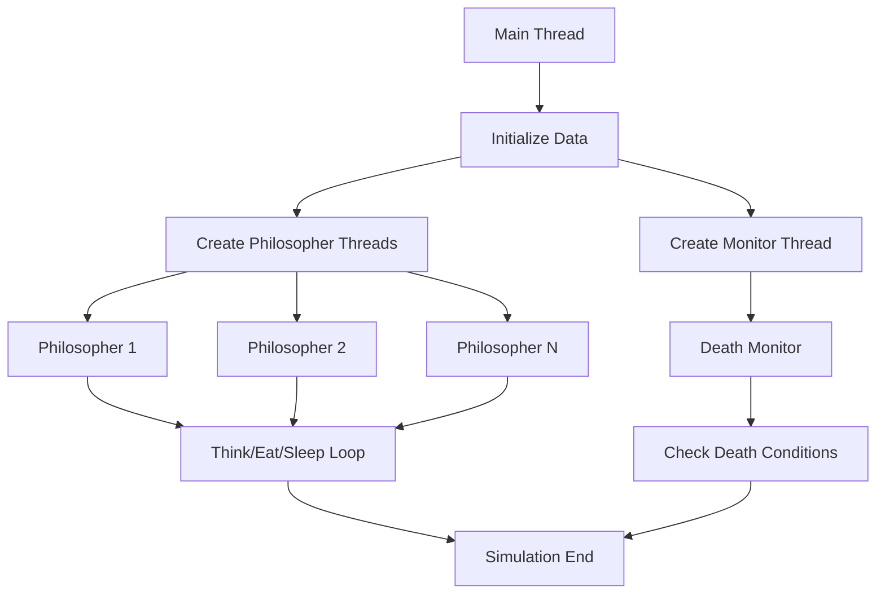

# 🍽️ Philosophers

[](https://42.fr)
[](https://en.wikipedia.org/wiki/C_(programming_language))
[](https://man7.org/linux/man-pages/man7/pthreads.7.html)
[](https://github.com/th3f/42-Cursus)

> *"The dining philosophers problem is a classic synchronization problem in computer science."* - Edsger Dijkstra

A multithreaded simulation of the famous Dining Philosophers problem, exploring concurrent programming, synchronization, and deadlock prevention.

## 📋 Table of Contents

- [🎯 About](#-about)
- [🧠 The Problem](#-the-problem)
- [✨ Features](#-features)
- [🔄 Synchronization](#-synchronization)
- [🚀 Installation](#-installation)
- [💻 Usage](#-usage)
- [⚙️ Algorithm](#️-algorithm)
- [🧵 Threading Model](#-threading-model)
- [📁 Project Structure](#-project-structure)
- [🧪 Testing](#-testing)
- [📚 Learning Objectives](#-learning-objectives)
- [📖 Resources](#-resources)

## 🎯 About

The **Philosophers** project is a 42 School assignment that implements the classic "Dining Philosophers Problem" using multithreading. This project teaches fundamental concepts of concurrent programming, synchronization mechanisms, and deadlock prevention strategies.

**Key Concepts:**
- Multithreading with pthreads
- Mutex synchronization
- Deadlock detection and prevention
- Resource sharing and contention
- Timing and performance optimization

## 🧠 The Problem

### The Classical Dining Philosophers Problem

Five philosophers sit around a circular table with a bowl of spaghetti in the center. There are five forks placed between the philosophers. Each philosopher spends their time thinking and eating. 

**The Rules:**
- A philosopher needs **two forks** to eat (left and right)
- Philosophers can only **think**, **eat**, or **sleep**
- After eating, a philosopher must **sleep**, then **think**
- The simulation stops when a philosopher **dies** from starvation

### The Challenge
```
     🍴
  😴     🍴
🍴         🍴  
  😴  🍝  😴
🍴         🍴
  😴     🍴
     🍴
```

**Synchronization Issues:**
- **Deadlock**: All philosophers pick up their left fork simultaneously
- **Starvation**: One philosopher never gets to eat
- **Race Conditions**: Multiple threads accessing shared resources

## ✨ Features

### 🌟 Core Simulation Features
- **Configurable Parameters**: Number of philosophers, timing values
- **Real-time Monitoring**: Live status updates for each philosopher
- **Death Detection**: Immediate simulation termination on philosopher death
- **Precise Timing**: Microsecond-accurate time management
- **Resource Management**: Proper cleanup of threads and mutexes

### 🔄 Synchronization Features
- **Mutex Protection**: Fork access synchronization
- **Deadlock Prevention**: Sophisticated fork acquisition strategy
- **Race Condition Elimination**: Thread-safe state management
- **Performance Optimization**: Minimal blocking and maximum concurrency

### 📊 Monitoring Features
- **State Logging**: Detailed philosopher activity logs
- **Timestamp Accuracy**: Precise event timing
- **Death Prevention**: Starvation monitoring and early detection
- **Clean Termination**: Graceful simulation shutdown

## 🔄 Synchronization

### Mutex Strategy
```c
typedef struct s_philosopher
{
    int             id;
    int             meals_eaten;
    long            last_meal_time;
    pthread_mutex_t *left_fork;
    pthread_mutex_t *right_fork;
    pthread_mutex_t *write_mutex;
    pthread_mutex_t *death_mutex;
    t_data          *data;
}   t_philosopher;
```

### Fork Acquisition Algorithm
```c
void    take_forks(t_philosopher *philo)
{
    if (philo->id % 2 == 0)
    {
        pthread_mutex_lock(philo->left_fork);
        log_action(philo, "has taken a fork");
        pthread_mutex_lock(philo->right_fork);
        log_action(philo, "has taken a fork");
    }
    else
    {
        pthread_mutex_lock(philo->right_fork);
        log_action(philo, "has taken a fork");
        pthread_mutex_lock(philo->left_fork);
        log_action(philo, "has taken a fork");
    }
}
```

### Deadlock Prevention
- **Odd/Even Strategy**: Even-numbered philosophers pick left fork first, odd-numbered pick right fork first
- **Resource Ordering**: Consistent fork acquisition order prevents circular wait
- **Timeout Mechanisms**: Prevent indefinite blocking on mutex operations

## 🚀 Installation

### Prerequisites
- **GCC** or **Clang** compiler with C99 support
- **POSIX** threads library (pthreads)
- **Make** build system
- **Unix/Linux** environment

### Build Instructions
```bash
# Clone the repository
git clone https://github.com/yourusername/42-Cursus.git
cd 42-Cursus/Philosophers/philo

# Build the project
make

# Clean build files
make clean

# Remove all generated files
make fclean

# Rebuild everything
make re
```

### Compilation Flags
```makefile
CFLAGS = -Wall -Wextra -Werror -pthread -g3
```

## 💻 Usage

### Basic Syntax
```bash
./philo [number_of_philosophers] [time_to_die] [time_to_eat] [time_to_sleep] [number_of_times_each_philosopher_must_eat]
```

### Parameters
| Parameter | Description | Unit | Required |
|-----------|-------------|------|----------|
| `number_of_philosophers` | Number of philosophers (and forks) | count | ✅ |
| `time_to_die` | Time before a philosopher dies from starvation | milliseconds | ✅ |
| `time_to_eat` | Time a philosopher spends eating | milliseconds | ✅ |
| `time_to_sleep` | Time a philosopher spends sleeping | milliseconds | ✅ |
| `number_of_times_each_philosopher_must_eat` | Simulation stops when all philosophers have eaten this many times | count | ❌ |

### Example Usage
```bash
# Basic simulation: 5 philosophers, die in 800ms, eat for 200ms, sleep for 200ms
./philo 5 800 200 200

# Limited meals: Stop after each philosopher eats 3 times
./philo 5 800 200 200 3

# Stress test: Many philosophers with tight timing
./philo 10 500 100 100

# Survival test: Long starvation time
./philo 4 2000 400 400

# Edge case: Single philosopher
./philo 1 800 200 200
```

### Sample Output
```
0 1 has taken a fork
0 1 has taken a fork
0 1 is eating
200 1 is sleeping
200 2 has taken a fork
200 2 has taken a fork
200 2 is eating
400 1 is thinking
400 2 is sleeping
400 3 has taken a fork
...
1205 3 died
```

## ⚙️ Algorithm

### Main Simulation Loop
```c
void    *philosopher_routine(void *arg)
{
    t_philosopher *philo = (t_philosopher *)arg;
    
    if (philo->id % 2 == 0)
        usleep(100);  // Offset even philosophers
    
    while (!is_simulation_over(philo))
    {
        think(philo);
        take_forks(philo);
        eat(philo);
        release_forks(philo);
        sleep_philosopher(philo);
    }
    return (NULL);
}
```

### Death Monitoring
```c
void    *death_monitor(void *arg)
{
    t_data *data = (t_data *)arg;
    
    while (!data->simulation_over)
    {
        check_all_philosophers(data);
        check_meal_completion(data);
        usleep(1000);  // Check every 1ms
    }
    return (NULL);
}

int check_philosopher_death(t_philosopher *philo)
{
    long current_time = get_current_time();
    long time_since_last_meal;
    
    pthread_mutex_lock(philo->death_mutex);
    time_since_last_meal = current_time - philo->last_meal_time;
    
    if (time_since_last_meal > philo->data->time_to_die)
    {
        log_death(philo);
        philo->data->simulation_over = 1;
        pthread_mutex_unlock(philo->death_mutex);
        return (1);
    }
    pthread_mutex_unlock(philo->death_mutex);
    return (0);
}
```

### Precise Timing
```c
long    get_current_time(void)
{
    struct timeval tv;
    
    gettimeofday(&tv, NULL);
    return ((tv.tv_sec * 1000) + (tv.tv_usec / 1000));
}

void    precise_sleep(long milliseconds)
{
    long start_time = get_current_time();
    
    while (get_current_time() - start_time < milliseconds)
        usleep(100);  // Sleep in small increments for precision
}
```

## 🧵 Threading Model

### Thread Architecture


### Synchronization Primitives
```c
typedef struct s_data
{
    int                 philo_count;
    int                 time_to_die;
    int                 time_to_eat;
    int                 time_to_sleep;
    int                 meals_required;
    int                 simulation_over;
    long                start_time;
    pthread_mutex_t     *forks;
    pthread_mutex_t     write_mutex;
    pthread_mutex_t     death_mutex;
    pthread_t           *threads;
    pthread_t           monitor_thread;
    t_philosopher       *philosophers;
}   t_data;
```

### Thread Safety Measures
- **Fork Mutexes**: One mutex per fork to prevent simultaneous access
- **Write Mutex**: Protects console output from race conditions
- **Death Mutex**: Synchronizes death detection and simulation termination
- **Atomic Operations**: Use of volatile variables for shared state

## 📁 Project Structure

```
Philosophers/
└── philo/
    ├── Makefile              # Build configuration
    ├── philosophers.c        # Main program entry
    ├── inc/
    │   └── philosophers.h    # Header definitions
    ├── method/
    │   ├── init.c           # Initialization functions
    │   ├── routine.c        # Philosopher routines
    │   ├── actions.c        # Eating, sleeping, thinking
    │   ├── monitor.c        # Death monitoring
    │   └── cleanup.c        # Resource cleanup
    └── tools/
        ├── utils.c          # Utility functions
        ├── time.c           # Time management
        └── logging.c        # Output formatting
```

## 🧪 Testing

### Basic Functionality Tests
```bash
# Test normal execution
./philo 5 800 200 200

# Test with meal limit
./philo 5 800 200 200 3

# Test edge cases
./philo 1 800 200 200        # Single philosopher
./philo 2 400 200 200        # Minimum viable scenario
```

### Stress Testing
```bash
# Many philosophers
./philo 20 800 200 200

# Tight timing constraints
./philo 4 310 200 100

# Very fast execution
./philo 5 100 50 50
```

### Death Testing
```bash
# Guaranteed death scenario
./philo 4 200 300 100        # time_to_eat > time_to_die

# Borderline survival
./philo 4 400 200 200
```

### Memory and Performance Testing
```bash
# Memory leak detection
valgrind --tool=memcheck --leak-check=full ./philo 5 800 200 200

# Thread analysis
valgrind --tool=helgrind ./philo 5 800 200 200

# Performance profiling
time ./philo 10 1000 200 200 5
```

### Automated Test Script
```bash
#!/bin/bash

echo "Testing Philosophers Project..."

# Test cases
test_cases=(
    "5 800 200 200"
    "5 800 200 200 3"
    "4 310 200 100"
    "1 800 200 200"
    "2 400 200 200"
)

for test in "${test_cases[@]}"; do
    echo "Testing: ./philo $test"
    timeout 10s ./philo $test
    echo "Exit code: $?"
    echo "---"
done
```

## 📚 Learning Objectives

After completing this project, you will understand:

### 🧵 Concurrent Programming
- Thread creation and management with pthreads
- Synchronization mechanisms (mutexes, semaphores)
- Race condition detection and prevention
- Deadlock analysis and avoidance strategies

### ⏱️ Timing and Performance
- High-precision time measurement techniques
- Performance optimization in multithreaded environments
- CPU scheduling and thread context switching
- Timing-sensitive algorithm design

### 🔒 Synchronization Patterns
- Producer-consumer problem variations
- Reader-writer synchronization
- Resource allocation strategies
- Critical section management

### 🛠️ System Programming
- Process vs. thread differences
- Memory sharing between threads
- Signal handling in multithreaded programs
- Operating system scheduling concepts

## 📖 Resources

### 📚 Concurrent Programming
- [The Little Book of Semaphores](https://greenteapress.com/wp/semaphores/)
- [Operating Systems: Three Easy Pieces](https://pages.cs.wisc.edu/~remzi/OSTEP/)
- [Programming with POSIX Threads](https://www.amazon.com/Programming-POSIX-Threads-David-Butenhof/dp/0201633922)

### 🔧 Threading Tutorials
- [POSIX Threads Programming](https://computing.llnl.gov/tutorials/pthreads/)
- [Multithreading in C](https://www.geeksforgeeks.org/multithreading-c-2/)
- [Thread Synchronization](https://stackoverflow.com/questions/34510/what-is-a-race-condition)

### 🧠 Problem Analysis
- [Dining Philosophers Problem](https://en.wikipedia.org/wiki/Dining_philosophers_problem)
- [Deadlock Prevention Strategies](https://www.geeksforgeeks.org/deadlock-prevention/)
- [Classical Synchronization Problems](https://www.tutorialspoint.com/operating_system/os_process_synchronization.htm)

### 🛠️ Debugging Tools
- [Valgrind Helgrind](https://valgrind.org/docs/manual/hg-manual.html)
- [Thread Sanitizer](https://clang.llvm.org/docs/ThreadSanitizer.html)
- [GDB Multithreading](https://sourceware.org/gdb/onlinedocs/gdb/Threads.html)

---

<div align="center">

**Philosophers** - Mastering the art of concurrent programming 🍽️

*Made with ❤️ at 42 School*

</div>
