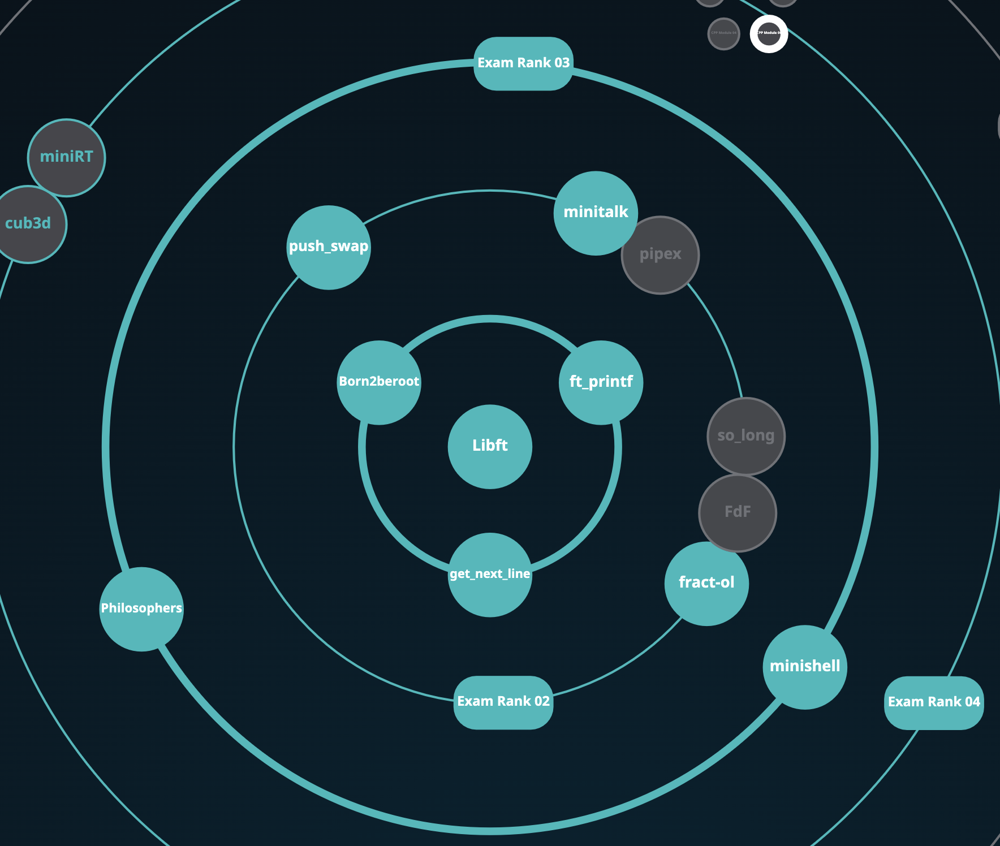

<div align="center">


<div align="center">
  

</div>
<br>




<p align="center">
  
  

</p>

<p align="center">
  
  
  
</p>

*✨ Transforming lines of code into digital poetry ✨*

</div>

## 📚 Projects Overview

<div align="center">
<h3>🌟 Journey Through the 42 Curriculum 🌟</h3>
<p><em>Each project is a step forward in mastering low-level programming</em></p>
</div>

<div align="center">
<table>
<tr>
<td align="center" width="200">

### 🔧 [Libft](./Libft)
**C Library Foundation**  
*Building blocks of programming*
<br>

<br>


</td>
<td align="center" width="200">

### 🖨️ [ft_printf](./ft_printf)
**Printf Implementation**  
*Variadic functions mastery*
<br>

<br>


</td>
<td align="center" width="200">

### 📖 [get_next_line](./get_next_line)
**File Reading Efficiency**  
*Memory management expert*
<br>

<br>


</td>
</tr>
<tr>
<td align="center">

### 📡 [Minitalk](./Minitalk)
**Client-Server Communication**  
*UNIX signals mastery*
<br>

<br>


</td>
<td align="center">

### 🌀 [fract-ol](./fract-ol)
**Fractal Visualization**  
*Mathematical beauty in code*
<br>

<br>


</td>
<td align="center">

### 🐚 [Minishell](./Minishell)
**Shell Implementation**  
*System programming mastery*
<br>

<br>


</td>
</tr>
<tr>
<td align="center">

### 🤔 [Philosophers](./Philosophers)
**Threading & Synchronization**  
*Concurrency challenges*
<br>

<br>


</td>
<td align="center">

### 💻 [C++ Modules](./Cpp-Modules)
**Object Oriented Programming**  
*C++ fundamentals*
<br>

<br>


</td>
<td align="center">

### 🚧 *More Coming Soon...*
**Next Adventure**  
*Stay tuned for updates*
<br>


</td>
</tr>
</table>
</div>

## 🎯 Learning Objectives


- 🔍 **Low-level Programming**: Deep understanding of C and system calls
- 🧠 **Problem Solving**: Complex algorithmic challenges and optimization
- 🏗️ **Software Architecture**: Building robust, scalable, and maintainable applications
- 🤝 **Collaboration**: Working with peers on challenging projects and code reviews
- 📈 **Continuous Learning**: Adapting to new technologies and programming methodologies
- 🎨 **Code Quality**: Writing clean, efficient, and well-documented code
- 🔒 **Security Awareness**: Understanding memory safety and secure programming practices

## 🛠️ Technologies & Skills

<div align="center">

### Core Languages


### Development Tools


### Specialized Areas


</div>

## 📊 Progress Stats

<div align="center">


<details>
<summary>📈 Detailed Project Progress</summary>

| Project | Status | Grade | Difficulty | Skills Learned |
|---------|--------|-------|------------|----------------|
| Libft | ✅ Complete | 125/100 | ⭐⭐ | C fundamentals, memory management |
| ft_printf | ✅ Complete | 100/100 | ⭐⭐⭐ | Variadic functions, format parsing |
| get_next_line | ✅ Complete | 125/100 | ⭐⭐ | File handling, static variables |
| Minitalk | ✅ Complete | 125/100 | ⭐⭐⭐ | UNIX signals, client-server |
| fract-ol | ✅ Complete | 125/100 | ⭐⭐⭐⭐ | Graphics programming, mathematics |
| Minishell | ✅ Complete | 101/100 | ⭐⭐⭐⭐⭐ | System calls, process management |
| Philosophers | ✅ Complete | 100/100 | ⭐⭐⭐⭐ | Threading, mutex, synchronization |

</details>


</div>

## 💪 Skills Progress

<div align="center">

<table>
<tr>
<td>

**Programming Languages**
```text
C              ████████████████████ 100%
C++            ██████████████░░░░░░  70%
Shell Script   ████████████████░░░░  80%
```

</td>
<td>

**System Programming**
```text
Memory Mgmt    ████████████████████ 100%
Process Mgmt   ████████████████░░░░  80%
Threading      ███████████████░░░░░  75%
```

</td>
</tr>
<tr>
<td>

**Development Tools**
```text
Git            ████████████████████ 100%
Makefile       ████████████████████ 100%
Debugging      ████████████████░░░░  80%
```

</td>
<td>

**Algorithms & Data Structures**
```text
Algorithms     ███████████████░░░░░  75%
Data Struct    ████████████████░░░░  80%
Optimization   ██████████░░░░░░░░░░  50%
```

</td>
</tr>
</table>

</div>

## 🏆 Achievements

<div align="center">

<table>
<tr>
<td align="center" width="25%">
🏆
<br><strong>Peer-to-Peer Learning</strong>
<br><small>Active participant in code reviews and knowledge sharing</small>
</td>
<td align="center" width="25%">
🎯
<br><strong>Project Excellence</strong>
<br><small>Consistent high-quality deliverables</small>
</td>
<td align="center" width="25%">
💡
<br><strong>Innovation</strong>
<br><small>Creative solutions to complex problems</small>
</td>
<td align="center" width="25%">
🤝
<br><strong>Community Contributor</strong>
<br><small>Helping fellow students succeed</small>
</td>
</tr>
</table>

</div>

## 📞 Connect With Me

<div align="center">

[](https://github.com/wmbolles)
[](https://profile.intra.42.fr/)

<br>

### 📧 Let's Collaborate!

 <em><b>I love connecting with different people</b> so if you want to say <b>hi, I'll be happy to meet you more!</b> :)</em>

</div>

---

<div align="center">

**Made with ❤️ by [wabolles](https://github.com/wmbolles)**  
*"The only way to do great work is to love what you do" - Steve Jobs*


</div>
