<div align="center">

# 🏊‍♂️ 42 Piscine

[](https://42.fr)
[](https://en.wikipedia.org/wiki/C_(programming_language))
[](https://www.gnu.org/software/bash/)
[](https://github.com/th3f/42-Cursus)

```
 ██████╗    ██████╗        ██████╗ ██╗███████╗ ██████╗██╗███╗   ██╗███████╗
██╔════╝   ██╔════╝        ██╔══██╗██║██╔════╝██╔════╝██║████╗  ██║██╔════╝
██║  ███╗ █████╗         ██████╔╝██║███████╗██║     ██║██╔██╗ ██║█████╗  
██║   ██║  ██╔══╝         ██╔═══╝ ██║╚════██║██║     ██║██║╚██╗██║██╔══╝  
╚██████╔╝  ███████╗        ██║     ██║███████║╚██████╗██║██║ ╚████║███████╗
 ╚═════╝   ╚══════╝        ╚═╝     ╚═╝╚══════╝ ╚═════╝╚═╝╚═╝  ╚═══╝╚══════╝
```

> *"In the depth of winter, I finally learned that within me there lay an invincible summer."* - Albert Camus

A comprehensive documentation of my journey through the intensive 42 School Piscine - 26 days of pure C programming immersion.

</div>

## 📋 Table of Contents

- [🎯 About the Piscine](#-about-the-piscine)
- [📊 Academic Results](#-academic-results)
- [🏗️ Projects Overview](#️-projects-overview)
- [🔧 Skills Developed](#-skills-developed)
- [📈 Progress Timeline](#-progress-timeline)
- [💻 Technologies Used](#-technologies-used)
- [📁 Repository Structure](#-repository-structure)
- [🧪 Testing & Validation](#-testing--validation)
- [📚 Learning Outcomes](#-learning-outcomes)
- [📖 Resources](#-resources)

## 🎯 About the Piscine

The **42 Piscine** is an intensive 26-day programming bootcamp that serves as the selection process for 42 School. It's designed to teach the fundamentals of C programming through hands-on projects, peer learning, and continuous evaluation.

### 🌊 The Experience
- **Duration**: 26 intensive days
- **Language**: C Programming
- **Methodology**: Learning by doing, peer-to-peer education
- **Evaluation**: Moulinette (automated testing) + peer evaluation
- **Environment**: Unix/Linux command line mastery

### 🎯 Core Philosophy
- **No teachers**: Self-learning and peer collaboration
- **No courses**: Learning through project-based assignments
- **No books**: Documentation reading and research skills
- **Trial and error**: Building resilience and problem-solving abilities

## 📊 Academic Results

<div align="center">

### 🏆 Final Statistics

| **Metric** | **Result** |
|------------|------------|
| **Overall Average** | `87.8%` |
| **Projects Completed** | `13/13` |
| **Exams Passed** | `3/4` |
| **Rush Projects** | `1/1` |
| **Days Survived** | `26/26` |

</div>

### 📈 Performance Overview

```
Average Score: ████████████████████▒▒ 87.8%
Completion Rate: ████████████████████████ 100%
Exam Success: ██████████████████▒▒▒▒▒▒ 75%
```

## 🏗️ Projects Overview

### 🐚 **Shell Projects**
| Project | Description | Score | Status |
|---------|-------------|-------|--------|
| **Shell00** | Unix command line basics |  | ✅ |
| **Shell01** | Advanced shell scripting |  | ✅ |

**Key Concepts**: File permissions, shell scripting, command line navigation, environment variables

---

### 💻 **C Programming Days**

#### 📚 **C00 - First Steps**
| Exercise | Function | Score | Status |
|----------|----------|-------|--------|
| ex00 | `ft_putchar` | ✅ | First program output |
| ex01 | `ft_print_alphabet` | ✅ | Character iteration |
| ex02 | `ft_print_reverse_alphabet` | ✅ | Reverse loops |
| ex03 | `ft_print_numbers` | ✅ | Numeric output |
| ex04 | `ft_is_negative` | ✅ | Conditional logic |
| ex05 | `ft_print_comb` | ✅ | Combination algorithms |
| ex06 | `ft_print_comb2` | ✅ | Two-digit combinations |
| ex07 | `ft_putnbr` | ✅ | Integer printing |
| ex08 | `ft_print_combn` | ✅ | N-digit combinations |

 **Perfect Score**

---

#### 🔗 **C01 - Pointers**
| Exercise | Function | Score | Status |
|----------|----------|-------|--------|
| ex00 | `ft_ft` | ✅ | Basic pointer usage |
| ex01 | `ft_ultimate_ft` | ✅ | Multiple indirection |
| ex02 | `ft_swap` | ✅ | Value swapping |
| ex03 | `ft_div_mod` | ✅ | Division and modulo |
| ex04 | `ft_ultimate_div_mod` | ✅ | Advanced operations |
| ex05 | `ft_putstr` | ✅ | String printing |
| ex06 | `ft_strlen` | ✅ | String length |
| ex07 | `ft_rev_int_tab` | ✅ | Array reversal |
| ex08 | `ft_sort_int_tab` | ✅ | Array sorting |

 **Perfect Score**

---

#### 📝 **C02 - Strings**
| Exercise | Function | Score | Status |
|----------|----------|-------|--------|
| ex00 | `ft_strcpy` | ✅ | String copying |
| ex01 | `ft_strncpy` | ✅ | Limited string copy |
| ex02 | `ft_str_is_alpha` | ✅ | Alphabetic validation |
| ex03 | `ft_str_is_numeric` | ✅ | Numeric validation |
| ex04 | `ft_str_is_lowercase` | ✅ | Lowercase validation |
| ex05 | `ft_str_is_uppercase` | ✅ | Uppercase validation |
| ex06 | `ft_str_is_printable` | ✅ | Printable validation |
| ex07 | `ft_strupcase` | ✅ | String to uppercase |
| ex08 | `ft_strlowcase` | ✅ | String to lowercase |
| ex09 | `ft_strcapitalize` | ✅ | Word capitalization |
| ex10 | `ft_strlcpy` | ✅ | Safe string copy |
| ex11 | `ft_putstr_non_printable` | ❌ | Non-printable display |
| ex12 | `ft_print_memory` | ⏱️ | Memory dump (Timeout) |

 **Good Progress**

---

#### 🔧 **C03 - String Comparison**
| Exercise | Function | Score | Status |
|----------|----------|-------|--------|
| ex00 | `ft_strcmp` | ✅ | String comparison |
| ex01 | `ft_strncmp` | ✅ | Limited comparison |
| ex02 | `ft_strcat` | ✅ | String concatenation |
| ex03 | `ft_strncat` | ✅ | Limited concatenation |
| ex04 | `ft_strstr` | ✅ | Substring search |
| ex05 | `ft_strlcat` | ✅ | Safe concatenation |

 **Perfect Score**

---

#### 🔄 **C05 - Recursion**
| Exercise | Function | Score | Status |
|----------|----------|-------|--------|
| ex00 | `ft_iterative_factorial` | ✅ | Iterative factorial |
| ex01 | `ft_recursive_factorial` | ✅ | Recursive factorial |
| ex02 | `ft_iterative_power` | ✅ | Iterative power |
| ex03 | `ft_recursive_power` | ✅ | Recursive power |
| ex04 | `ft_fibonacci` | ✅ | Fibonacci sequence |
| ex05 | `ft_sqrt` | ✅ | Square root |
| ex06 | `ft_is_prime` | ✅ | Prime number check |
| ex07 | `ft_find_next_prime` | ✅ | Next prime finder |
| ex08 | `ft_ten_queens_puzzle` | ❌ | N-Queens problem |

 **Strong Performance**

---

#### 📊 **C06 - Command Line Arguments**
| Exercise | Function | Score | Status |
|----------|----------|-------|--------|
| ex00 | `ft_print_program_name` | ✅ | Program name display |
| ex01 | `ft_print_params` | ✅ | Parameter printing |
| ex02 | `ft_rev_params` | ✅ | Reverse parameter order |
| ex03 | `ft_sort_params` | ✅ | Parameter sorting |

 **Perfect Score**

---

#### 🧠 **C07 - Memory Allocation**
| Exercise | Function | Score | Status |
|----------|----------|-------|--------|
| ex00 | `ft_strdup` | ✅ | String duplication |
| ex01 | `ft_range` | ✅ | Range array creation |
| ex02 | `ft_ultimate_range` | ✅ | Advanced range |
| ex03 | `ft_strjoin` | ✅ | String joining |
| ex04 | `ft_convert_base` | ❌ | Base conversion |
| ex05 | `ft_split` | ❌ | String splitting |

 **Learning Progress**

---

#### 📋 **C08 - Headers and Macros**
| Exercise | Function | Score | Status |
|----------|----------|-------|--------|
| ex00 | `ft.h` | ✅ | Basic header |
| ex01 | `ft_boolean.h` | ✅ | Boolean definitions |
| ex02 | `ft_abs.h` | ✅ | Absolute value macro |
| ex03 | `ft_point.h` | ✅ | Point structure |
| ex04 | `ft_strs_to_tab.h` | ✅ | String to struct |
| ex05 | `ft_show_tab` | ✅ | Struct display |

 **Perfect Score**

---

#### 📚 **C09 - Makefiles**
| Exercise | Function | Score | Status |
|----------|----------|-------|--------|
| ex00 | `libft_creator.sh` | ✅ | Library creation script |
| ex01 | `Makefile` | ✅ | Basic Makefile |
| ex02 | `ft_split.c` | ✅ | String splitting function |

 **Perfect Score**

---

#### 🔍 **C11 - Function Pointers**
| Exercise | Function | Score | Status |
|----------|----------|-------|--------|
| ex00 | `ft_foreach` | ✅ | Array iteration |
| ex01 | `ft_map` | ✅ | Array mapping |
| ex02 | `ft_any` | ✅ | Boolean check |
| ex03 | `ft_count_if` | ✅ | Conditional counting |
| ex04 | `ft_is_sort` | ✅ | Sort verification |
| ex05 | `ft_do_op` | ✅ | Calculator |
| ex06 | `ft_sort_string_tab` | ✅ | String array sort |
| ex07 | `ft_advanced_sort_string_tab` | ✅ | Advanced sorting |

 **Perfect Score**

---

### 🏃‍♂️ **Rush Projects**

#### 🏁 **Rush00 - Pattern Generation**
- **Objective**: Create rectangle patterns with different corner/edge characters
- **Team Size**: 3 people
- **Duration**: Weekend (48 hours)
- **Result**:  **Bonus Achieved**

**Key Learning**: Team collaboration, algorithm optimization, pattern recognition

---

### 📝 **Exam Results**

| Exam | Score | Status | Topics Covered |
|------|-------|--------|----------------|
| **Exam 00** |  | ❌ | Basic C syntax, variables, conditions |
| **Exam 01** |  | ✅ | Loops, functions, basic algorithms |
| **Exam 02** |  | ✅ | Strings, arrays, pointers |
| **Final Exam** |  | ✅ | Comprehensive C programming |

## 🔧 Skills Developed

### 💻 **Programming Fundamentals**
- ✅ **C Language Mastery**: Syntax, semantics, and best practices
- ✅ **Memory Management**: Pointers, dynamic allocation, memory safety
- ✅ **Algorithm Design**: Problem-solving and optimization techniques
- ✅ **Data Structures**: Arrays, strings, linked structures

### 🛠️ **System Programming**
- ✅ **Unix/Linux Command Line**: Navigation, file operations, permissions
- ✅ **Shell Scripting**: Automation and system administration
- ✅ **Compilation Process**: GCC, Makefiles, linking
- ✅ **Debugging**: GDB, Valgrind, error analysis

### 🤝 **Soft Skills**
- ✅ **Self-Learning**: Independent research and problem-solving
- ✅ **Peer Collaboration**: Code reviews and knowledge sharing
- ✅ **Resilience**: Handling failure and continuous improvement
- ✅ **Time Management**: Meeting deadlines under pressure

## 📈 Progress Timeline

```mermaid
gantt
    title 42 Piscine - 26 Days Journey
    dateFormat  X
    axisFormat %d
    
    section Shell
    Shell00    :done, s0, 0, 2
    Shell01    :done, s1, 2, 4
    
    section C Days
    C00        :done, c0, 4, 6
    C01        :done, c1, 6, 8
    C02        :done, c2, 8, 10
    C03        :done, c3, 10, 12
    C05        :done, c5, 14, 16
    C06        :done, c6, 16, 18
    C07        :done, c7, 18, 20
    C08        :done, c8, 20, 22
    C09        :done, c9, 22, 24
    C11        :done, c11, 26, 28
    
    section Rush
    Rush00     :done, r0, 12, 14
    
    section Exams
    Exam00     :crit, e0, 6, 6
    Exam01     :done, e1, 12, 12
    Exam02     :done, e2, 18, 18
    Final      :done, ef, 26, 26
```



## 💻 Technologies Used

<div align="center">


</div>

### 🔧 **Development Tools**
- **Compiler**: GCC with strict flags (`-Wall -Wextra -Werror`)
- **Debugger**: GDB for runtime debugging
- **Memory Checker**: Valgrind for memory leak detection
- **Build System**: Make and Makefiles
- **Version Control**: Git for code management
- **Text Editor**: Vim/Emacs for efficient coding

### 📚 **Core Libraries**
- **Standard C Library**: stdio.h, stdlib.h, string.h, unistd.h
- **System Calls**: write(), read(), malloc(), free()
- **Mathematical Functions**: Math library for advanced calculations

## 📁 Repository Structure

```
42-Piscine/
├── README.md                 # This comprehensive guide
├── images/                   # Screenshots and visual documentation
│   ├── Screenshot 2023-08-27 120959.png
│   └── Screenshot 2023-08-28 210910.png
├── shell_00/                 # Unix basics and shell commands
│   ├── ex00/ - ex09/        # File operations and permissions
├── shell_01/                 # Advanced shell scripting
│   ├── ex01/ - ex08/        # Environment variables and scripting
├── c00/                      # C basics and first programs
│   ├── ex00/ - ex08/        # Output functions and loops
├── c01/                      # Pointers and memory
│   ├── ex00/ - ex08/        # Pointer manipulation and arrays
├── c02/                      # String manipulation
│   ├── ex00/ - ex12/        # String functions and validation
├── c03/                      # String comparison and concatenation
│   ├── ex00/ - ex05/        # Advanced string operations
├── c04/                      # [Not completed]
├── c05/                      # Mathematical functions and recursion
│   ├── ex00/ - ex08/        # Factorials, power, and fibonacci
├── c06/                      # Command line arguments
│   ├── ex00/ - ex03/        # argc/argv manipulation
├── c07/                      # Dynamic memory allocation
│   ├── ex00/ - ex05/        # malloc, free, and memory management
├── c08/                      # Header files and structures
│   ├── ex00/ - ex05/        # Preprocessor and data structures
├── c09/                      # Makefiles and compilation
│   ├── ex00/ - ex02/        # Build automation
├── c11/                      # Function pointers and callbacks
│   ├── ex00/ - ex07/        # Advanced function manipulation
└── rush_00/                  # Weekend team project
    ├── rush00/              # Pattern generation algorithms
    └── rush01/              # Logic puzzle solving
```

## 🧪 Testing & Validation

### 🤖 **Moulinette Testing**
The Moulinette is 42's automated testing system that validates code against:
- **Compilation**: Code must compile without errors or warnings
- **Functionality**: Output must match expected results exactly
- **Edge Cases**: Handling of NULL pointers, empty strings, etc.
- **Performance**: Execution time and memory usage limits
- **Norm Compliance**: Adherence to 42's coding standards

### 🔍 **Testing Methodologies**
```c
// Example of rigorous testing approach
int main(void)
{
    // Test normal cases
    assert(ft_strlen("Hello") == 5);
    
    // Test edge cases
    assert(ft_strlen("") == 0);
    assert(ft_strlen(NULL) == 0);  // If handling NULL
    
    // Test boundary conditions
    char long_str[1000];
    memset(long_str, 'a', 999);
    long_str[999] = '\0';
    assert(ft_strlen(long_str) == 999);
    
    printf("All tests passed!\n");
    return (0);
}
```

### 📊 **Quality Metrics**
- **Code Coverage**: Comprehensive test cases for all functions
- **Memory Safety**: No leaks, no segmentation faults
- **Performance**: Optimized algorithms for large datasets
- **Readability**: Clean, well-commented code

## 📚 Learning Outcomes

### 🧠 **Technical Skills Acquired**

#### **Programming Fundamentals**
- **Variable Management**: Understanding of data types, scope, and lifetime
- **Control Structures**: Mastery of loops, conditionals, and branching
- **Function Design**: Creating modular, reusable code components
- **Error Handling**: Robust input validation and error management

#### **Advanced C Concepts**
- **Pointer Arithmetic**: Direct memory manipulation and address calculation
- **Dynamic Memory**: Malloc, free, and memory leak prevention
- **String Processing**: Efficient text manipulation algorithms
- **Recursion**: Mathematical and algorithmic recursive solutions

#### **System Programming**
- **Memory Layout**: Understanding stack, heap, and program segments
- **Compilation Process**: From source code to executable
- **File Operations**: Reading, writing, and manipulating files
- **Process Management**: Understanding program execution

### 🌟 **Personal Development**

#### **Problem-Solving Methodology**
1. **Problem Analysis**: Breaking down complex problems into smaller parts
2. **Algorithm Design**: Creating step-by-step solution approaches
3. **Implementation**: Translating algorithms into working code
4. **Testing & Debugging**: Systematic error detection and correction
5. **Optimization**: Improving performance and code quality

#### **Learning Strategies**
- **Documentation Reading**: Man pages, technical specifications
- **Peer Learning**: Code reviews and knowledge sharing
- **Trial and Error**: Experimental learning and iteration
- **Pattern Recognition**: Identifying common programming patterns


---

<div align="center">

### 🏊‍♂️ The Piscine Experience

*"The Piscine is not just about learning to code - it's about learning to learn, to persevere, and to grow both technically and personally. Every failed compilation, every segmentation fault, and every successful test case contributed to building the foundation for a career in software engineering."*

**Survival Statistics:**
- 🗓️ **26 days** of intensive coding
- ⏰ **500+ hours** of programming
- 🧠 **100+ exercises** completed
- 🤝 **Countless** peer interactions
- 💡 **Infinite** learning moments

### 🌟 Key Takeaways

1. **Persistence** - Never give up, even when facing seemingly impossible challenges
2. **Community** - Learning is enhanced through collaboration and mutual support
3. **Fundamentals** - Strong basics create a solid foundation for advanced concepts
4. **Growth Mindset** - Every mistake is an opportunity to learn and improve

---

**42 Piscine** - Where swimmers become developers 🏊‍♂️→👨‍💻

*Made with ❤️ and countless cups of coffee ☕*

</div>
